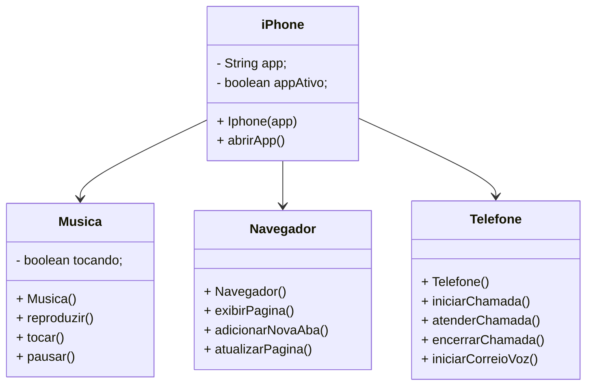

# Diagrama de Classes do iPhone

```mermaid
classDiagram

    class iPhone {
        - String app;
        - boolean appAtivo;
        
        + Iphone(app)
        + abrirApp()
    }

    class Musica {
        - boolean tocando;

        + Musica()
        + reproduzir()
        + tocar()
        + pausar()
    }

    class Navegador {
        + Navegador()
        + exibirPagina()
        + adicionarNovaAba()
        + atualizarPagina()
    }

    class Telefone {
        + Telefone()
        + iniciarChamada()
        + atenderChamada()
        + encerrarChamada()
        + iniciarCorreioVoz()
    }

iPhone --> Musica
iPhone --> Navegador
iPhone --> Telefone

```
